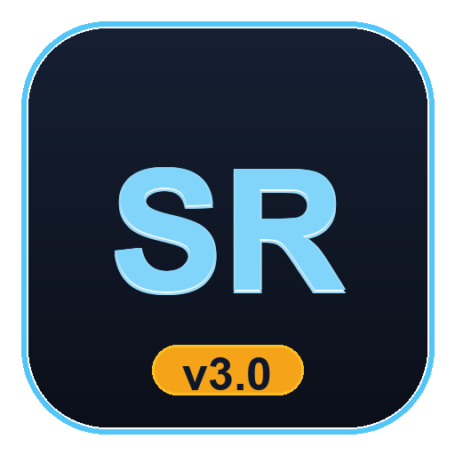

# 🎮 SkinRate Calculator Pro

<p align="center">
  
</p>

<p align="center">
  <b>The ultimate CS2 & Steam wallet rate calculator for Bangladeshi traders and gamers.</b><br>
  Accurate Steam 15% Market tax breakdown, MFS cashout fees (bKash/Nagad), dual item & wallet rates, reverse conversions, and 1-click trade receipts.
</p>

<p align="center">
  
  
  
</p>

---

## ✨ Features at a Glance

### 🖥️ Modern Desktop UI with Top Application Toolbar
- **Native Top Toolbar**: Fast navigation across all calculator modes, quick theme toggle, history log, trade slip exporter, and settings.
- **Dark & Light Modes**: CS2 Slate Dark Theme (default) or crisp Clean Light Theme (`Ctrl+T`).
- **High-DPI Razor-Sharp Text**: Integrated Windows per-monitor DPI scaling for crisp display on 1080p, 2K, and 4K displays.
- **Preset Quick-Chips**: One-click input for common amounts (`$10`, `$25`, `$50`, `$100`, `$200`) and standard rates (`118`, `120`, `121`, `122`).
- **Live Instant Calculation**: Calculations update in real time as you type or adjust chips.

### 🧮 Exact Steam 15% Market Fee & Flip Profit
- **Exact Valve Math**: Precise integer cent algorithm (Valve 5% min $0.01 + CS2 Game 10% min $0.01).
- **Buyer Pays vs Seller Receives**: Accurate calculation in both directions.
- **CS2 Skin Flipping & ROI Calculator**: Calculate profit margins when buying skins from third-party markets (Buff, CSFloat) and selling on Steam Market.

### 💳 Bangladeshi MFS Cashout Calculator
- **bKash Agent** (1.85% / 18.5 Tk per 1,000 Tk)
- **bKash Priyo Number / App** (1.49% / 14.9 Tk per 1,000 Tk)
- **Nagad App** (1.25% / 12.5 Tk per 1,000 Tk)
- **Dual Perspectives**:
  - *Buyer Sends (Fee Added)*: Total amount buyer must send so seller gets exact cost.
  - *Cash in Hand (Fee Deducted)*: Liquid cash received after cashout fee.

### ⇄ Reverse Calculator (৳ Budget ➔ $ Skins / Wallet)
- Find how much USD skin or wallet value you can get with your exact BDT budget or cashout target.

### 📊 Live Cheat Sheet Rate Matrix ($1 to $1,000)
- Interactive table showing all standard CS2 amounts ($1, $2.5, $5, $10, $20, $50, $100, $250, $500).
- Updates in real-time as you tweak rates.
- **1-Click Copy Table**: Formatted ASCII table ready to share in Facebook groups or Discord.

### 📋 One-Click Trade Slip Exporter
- Copy a clean trade receipt formatted for Discord, Facebook, WhatsApp, or Messenger.
- Formats: **Box Unicode Borders**, **Discord Markdown**, or **Compact Plain Text**.

### ⚙️ Persistent Settings & Trade History
- Remembers your favorite default rates, themes, and fee preferences between sessions.
- Optional BDT comma formatting (`৳12000` default, or `৳12,000`).
- Stores last 30 trade calculations with 1-click restore.

---

## ⌨️ Keyboard Shortcuts

| Shortcut | Action |
| :--- | :--- |
| **`Enter`** | Calculate Active View |
| **`Esc`** | Clear Fields / Reset Defaults |
| **`Ctrl + C`** | Open Trade Slip Exporter |
| **`Ctrl + T`** | Toggle Dark / Light Theme |
| **`Ctrl + H`** | View Calculation History |
| **`Ctrl + S`** | Open Preferences & Settings |
| **`Ctrl + 1`** | Switch to Standard Calculator |
| **`Ctrl + 2`** | Switch to Reverse Calculator |
| **`Ctrl + 3`** | Switch to Steam Market & Profit |
| **`Ctrl + 4`** | Switch to Rate Cheat Sheet |

---

## 🚀 Downloads

Go to the [**Releases**](../../releases) section and choose your preferred version:

1. **`SkinRate-Calculator-v3.0.0-Windows.exe`** (Recommended)
   - Single portable executable. No installation required.
2. **`SkinRate-Calculator-v3.0.0-Portable.zip`**
   - Unpack and run `SkinRate Calculator.exe`.
   - **Fastest Launch**: Sub-second startup (<0.1s) with zero extraction delay!

---

## 🛠️ Building from Source

To run or build the application from source:

```bash
# Clone the repository
git clone https://github.com/Smokianlord/SkinRate-Calculator.git
cd SkinRate-Calculator

# Install build dependencies
pip install -r requirements-build.txt

# Run unit tests
python tests/test_engine.py

# Run the application
python main.py

# Build release executables and portable zip
python build_release.py
```

---

## 📜 License

Distributed under the MIT License. See `LICENSE` for more information.
Created with ❤️ by **Smokianlord** for the Bangladeshi CS2 & Steam community.
